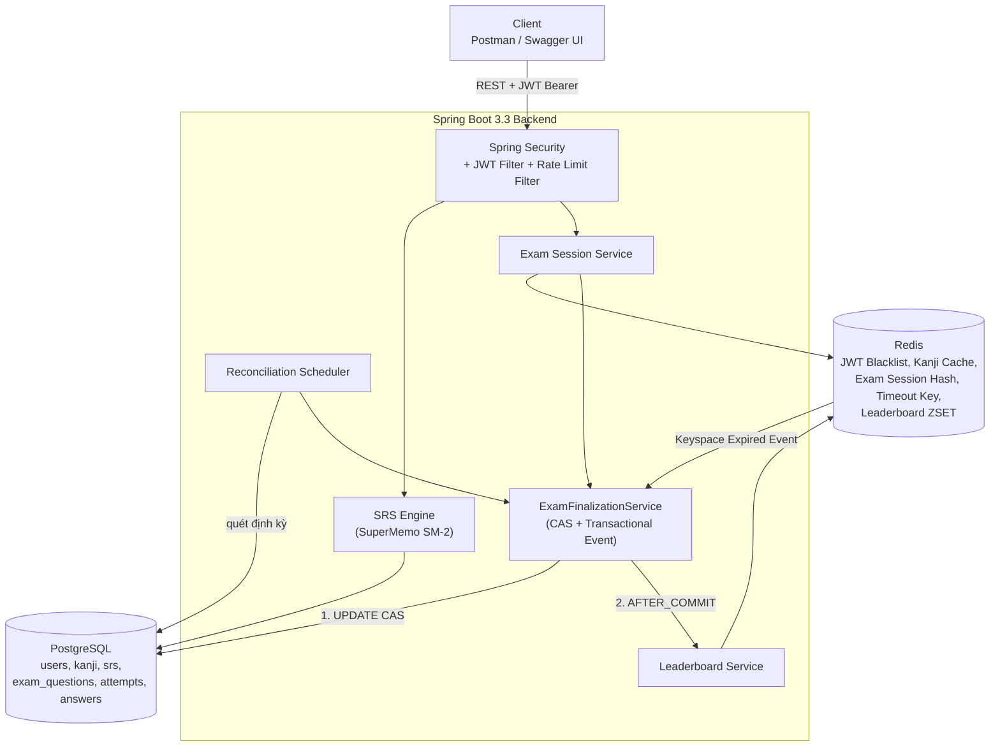

# Smart Kanji Mastery & JLPT Mock Exam Platform

Backend Spring Boot cho nền tảng học Kanji cá nhân hóa (lịch ôn SuperMemo SM-2 hoặc FSRS-6 tối ưu theo từng người) và thi thử JLPT trực tuyến với thi thời gian thực, chấm điểm chống race condition, và bảng xếp hạng cập nhật tức thì. Kèm live-demo Frontend React + TypeScript.

> Dự án được xây dựng theo kế hoạch chi tiết tại [k_ho_ch_tri_n_khai_d_n_spring_boot.md](k_ho_ch_tri_n_khai_d_n_spring_boot.md) — tài liệu đó ghi lại toàn bộ quá trình thiết kế, các vấn đề kỹ thuật phát sinh (race condition, dual-write, N+1 query...) và giải pháp tương ứng.

## Mục lục

- [Điểm sáng kỹ thuật](#điểm-sáng-kỹ-thuật)
- [Kiến trúc hệ thống](#kiến-trúc-hệ-thống)
- [Thuật toán SuperMemo SM-2](#thuật-toán-supermemo-sm-2)
- [Lịch ôn FSRS](#lịch-ôn-fsrs)
- [Cá nhân hoá việc học](#cá-nhân-hoá-việc-học)
- [Chấm điểm bài thi: Race Condition & Transaction Boundary](#chấm-điểm-bài-thi-race-condition--transaction-boundary)
- [Tối ưu hiệu năng Database](#tối-ưu-hiệu-năng-database)
- [Database Schema](#database-schema)
- [API Endpoints](#api-endpoints)
- [Frontend Demo](#frontend-demo)
- [Chạy dự án bằng Docker (1 lệnh)](#chạy-dự-án-bằng-docker-1-lệnh)
- [Sao lưu & khôi phục dữ liệu](#sao-lưu--khôi-phục-dữ-liệu)
- [Giới hạn tần suất & hạn mức AI](#giới-hạn-tần-suất--hạn-mức-ai)
- [Chạy dự án để phát triển (dev mode)](#chạy-dự-án-để-phát-triển-dev-mode)
- [Testing](#testing)
- [Cấu trúc thư mục](#cấu-trúc-thư-mục)

---

## Điểm sáng kỹ thuật

1. **Thuật toán SRS (SuperMemo SM-2)** tự cài đặt từ công thức gốc, không dùng thư viện có sẵn.
2. **Composite Index PostgreSQL** cho bảng tiến độ học — đo thật trên 250,000 dòng dữ liệu: **0.47ms** (xem [benchmark-explain-analyze.md](backend/docs/benchmark-explain-analyze.md)).
3. **Session Management & Auto-Submit qua Redis**: Redis Hash lưu bài làm dở, Redis Keyspace Notification tự động thu bài khi hết giờ.
4. **Reconciliation Job** — lớp dự phòng bù cho giới hạn "best-effort" của Keyspace Notification, đảm bảo không bài thi nào bị "treo" vĩnh viễn.
5. **Race Condition & Idempotency**: compare-and-swap ở tầng SQL giải quyết tranh chấp giữa 3 luồng có thể cùng chốt điểm 1 bài thi.
6. **Transaction Boundary rõ ràng**: tách hẳn thao tác PostgreSQL khỏi Redis bằng `@TransactionalEventListener(AFTER_COMMIT)`, tránh dual-write.
7. **Real-time Leaderboard** bằng Redis Sorted Set, không query sắp xếp nặng vào PostgreSQL.
8. **Testcontainers**: integration test chạy trên Postgres + Redis thật trong container tạm, không phụ thuộc môi trường máy dev, chạy được trong CI.
9. **Cá nhân hoá từ lịch sử trả lời**: mọi lần trả lời được ghi vào `review_logs`; trắc nghiệm chọn từ theo điểm yếu (weighted sampling Efraimidis-Spirakis), đáp án nhiễu lấy từ chính những lần người học chọn nhầm, phiên ôn mỗi ngày vừa với thời gian người học có và kịp ngày thi — xem [Cá nhân hoá việc học](#cá-nhân-hoá-việc-học).
10. **FSRS-6 tự cài bằng Java**, khớp từng con số với thư viện tham chiếu py-fsrs (golden test); tham số khởi đầu tối ưu riêng cho từng người theo bước pretrain của optimizer chính thức, và trang Tiến bộ so dự đoán của FSRS với trí nhớ thật — xem [Lịch ôn FSRS](#lịch-ôn-fsrs).
11. **Đề thi chỉ ra điểm yếu**: câu thi kiểu đề JLPT sinh từ kho từ vựng bằng chính bộ dựng câu hỏi của trắc nghiệm; kết quả chấm theo kỹ năng, và từ của câu sai tự vào lịch ôn qua listener `AFTER_COMMIT` + transaction `REQUIRES_NEW`, chỉ một lần cho mỗi bài thi.

---

## Kiến trúc hệ thống



**Luồng chốt điểm bài thi** (điểm kỹ thuật trọng tâm của dự án) có 3 nơi có thể kích hoạt gần như đồng thời — Submit thủ công, Redis Keyspace Expired Event, Reconciliation Job — nhưng đều đi qua **một điểm chốt duy nhất**: `ExamFinalizationService.finalize()`. Xem giải thích chi tiết ở [phần Race Condition](#chấm-điểm-bài-thi-race-condition--transaction-boundary).

---

## Thuật toán SuperMemo SM-2

Cài đặt tại [`SrsCalculatorService`](backend/src/main/java/com/kanjimastery/backend/service/SrsCalculatorService.java), theo đúng thuật toán gốc của Piotr Wozniak:

| Bước | Công thức / Quy tắc |
|---|---|
| Cập nhật độ dễ (EF) | $EF' = EF + (0.1 - (5-q) \times (0.08 + (5-q) \times 0.02))$ — áp dụng cho **mọi** giá trị $q \in [0,5]$ |
| Chặn dưới | $EF' = \max(EF', 1.3)$ |
| Interval lần 1 | $I_1 = 1$ ngày (nếu $q \ge 3$) |
| Interval lần 2 | $I_2 = 6$ ngày |
| Interval lần $n \ge 3$ | $I_n = \text{round}(I_{n-1} \times EF')$ — dùng EF **vừa cập nhật**, không phải EF cũ |
| Trả lời sai ($q < 3$) | Reset `repetition_count = 0`, `interval = 1 ngày` — **EF vẫn được cập nhật** theo công thức trên |

7 unit test tại [`SrsCalculatorServiceTest`](backend/src/test/java/com/kanjimastery/backend/service/SrsCalculatorServiceTest.java) phủ toàn bộ nhánh: $q=5$ liên tiếp, $q<3$ reset, chặn $EF \ge 1.3$, và validate input ngoài khoảng $[0,5]$.

Người học chấm thẻ theo 4 mức như Anki (Quên / Khó / Nhớ / Dễ), đổi sang $q$ = 1 / 3 / 4 / 5 trước khi vào công thức trên.

## Lịch ôn FSRS

[`Fsrs`](backend/src/main/java/com/kanjimastery/backend/service/Fsrs.java) là bản cài lại bằng Java của mô hình trí nhớ FSRS-6 (Free Spaced Repetition Scheduler, thuật toán Anki dùng), theo đúng công thức của thư viện tham chiếu py-fsrs: mỗi thẻ có **độ ổn định** $S$ (số ngày tới khi khả năng nhớ còn 90%) và **độ khó** $D$; khả năng nhớ sau $t$ ngày là $R = (1 + F \cdot t / S)^{-w_{20}}$, và khoảng ôn để lúc ôn còn nhớ đúng tỉ lệ mong muốn $r$ là $I = \frac{S}{F}(r^{-1/w_{20}} - 1)$. [`FsrsTest`](backend/src/test/java/com/kanjimastery/backend/service/FsrsTest.java) phát lại chính các chuỗi ôn trong test của py-fsrs và khớp kết quả (chuỗi khoảng ôn 0, 2, 11, 46, 163, 498...; $S$ = 53.62691, $D$ = 6.3574867).

| Phần | Cách làm |
|---|---|
| Chạy song song SM-2 | Mỗi lần ôn luôn cập nhật cả SM-2 lẫn trí nhớ FSRS, nên đổi qua lại lúc nào cũng được; ngày ôn tiếp theo theo thuật toán người học chọn ở trang Mục tiêu (mặc định SM-2). Thẻ ôn từ trước khi có FSRS được ước lượng: $S$ = khoảng ôn SM-2, $D$ suy từ EF. |
| Tỉ lệ nhớ mong muốn | 80 / 85 / 90 / 95%. Nút chấm thẻ hiện ngay số ngày tới lần ôn sau của từng mức ("Nhớ · 4 ngày"); phiên ôn hôm nay xếp thẻ theo khả năng nhớ thấp nhất trước. |
| Tham số riêng từng người | [`FsrsOptimizer`](backend/src/main/java/com/kanjimastery/backend/service/FsrsOptimizer.java) cài lại bước *pretrain* của optimizer chính thức (fsrs-rs): với mỗi mức chấm ở lần học đầu, tìm tam phân độ ổn định khớp nhất với việc từ còn nhớ hay đã quên ở lần ôn kế tiếp (làm trơn Laplace, trọng số căn bậc hai số mẫu, phạt $\lvert S - S_0 \rvert / 16$ với $S_0$ là giá trị mặc định để ít dữ liệu thì vẫn gần mặc định). Cần 50 từ cho một mức chấm; chạy mỗi sáng thứ Hai và khi người học bấm "Tối ưu ngay". Các tham số còn lại giữ mặc định — tối ưu chúng cần gradient descent trên toàn bộ lịch sử và nhiều dữ liệu hơn hẳn. |
| Kiểm chứng | Mỗi lần ôn lưu xác suất nhớ FSRS dự đoán; trang Tiến bộ so trung bình dự đoán với tỉ lệ nhớ thật 30 ngày qua, chỉ coi là lệch khi chênh quá hai lần sai số chuẩn. |

---

## Cá nhân hoá việc học

Mọi lần người học trả lời một từ — lật thẻ ôn tập, làm trắc nghiệm — là một dòng trong `review_logs` (nguồn, hướng hỏi, đúng/sai, mức 1-4, thời gian trả lời, đáp án đã chọn, trạng thái thẻ ngay trước đó). Các tính năng dưới đây đều là truy vấn trên bảng này, gom theo cả bài trong vài truy vấn chứ không truy vấn theo từng từ.

| Tính năng | Cách làm |
|---|---|
| Chấm điểm khách quan | Trắc nghiệm do server chấm; mức Dễ/Nhớ/Khó suy từ thời gian trả lời so với **trung vị của chính người học** (200 câu đúng gần nhất theo hướng hỏi). Đúng khi thẻ chưa đến hạn chỉ được ghi lại, vì SM-2 không tính tới ôn sớm. |
| Trắc nghiệm thích ứng | ~60% từ yếu (đến hạn, sai 14 ngày qua, EF thấp), ~25% từ chưa gặp, ~15% từ đã thuộc; bốc theo trọng số không lặp ([`AdaptiveQuizPlanner`](backend/src/main/java/com/kanjimastery/backend/service/AdaptiveQuizPlanner.java)). Hướng hỏi nghiêng về chiều người học hay sai. |
| Đáp án nhiễu cá nhân | Tối đa 2 đáp án sai người học từng chọn cho chính từ đó được đưa lại vào câu hỏi, trừ khi chúng cũng "đúng" (từ đồng âm, nghĩa/cách đọc của dòng khác cùng cách viết). |
| Từ khó | Đếm số lần quên một thẻ đang ôn bình thường (như leech của Anki); quên 6 lần là từ khó, có trang riêng và trắc nghiệm riêng. Mẹo nhớ dựa trên **âm Hán Việt** do Gemini sinh một lần cho mỗi từ, kèm ghi chú riêng của người học. |
| Kế hoạch hôm nay | Nhịp ôn đo từ khoảng cách giữa các lần chấm thẻ; số thẻ ôn vừa với số phút mỗi ngày, thẻ dễ quên nhất (trễ nhiều khoảng ôn nhất) trước; từ mới chỉ thêm khi còn chỗ (nạp n từ/ngày ≈ 4n lượt ôn/ngày) và xen giữa các thẻ ôn. "Hôm nay" tính theo giờ Việt Nam, bắt đầu lúc 4 giờ sáng ([`StudyPlanService`](backend/src/main/java/com/kanjimastery/backend/service/StudyPlanService.java)). |
| Mục tiêu & ngày thi | Từ chưa học của mọi bài từ N5 tới cấp mục tiêu chia đều tới 2 tuần trước kỳ thi; dự báo ngày học xong theo nhịp 2 tuần gần nhất; gợi ý bài tiếp theo khi sắp hết từ mới. |
| Tiến bộ | Tỉ lệ nhớ thật theo tuần (lần ôn đúng hạn từ đã thuộc), lượt ôn và từ mới theo ngày, độ chính xác trắc nghiệm theo kiểu câu hỏi, những chỗ hay nhầm nhất, FSRS đoán trí nhớ sát tới đâu. |
| Lịch ôn FSRS | FSRS-6 với tỉ lệ nhớ người học chọn và tham số khởi đầu tối ưu từ lịch sử ôn của chính họ — xem [Lịch ôn FSRS](#lịch-ôn-fsrs). |
| Đề thi chỉ ra điểm yếu | Mỗi câu thi gắn kỹ năng (đọc / viết / nghĩa) và từ vựng nó kiểm tra; bài thi chia đều các kỹ năng, mỗi từ tối đa một câu. Kết quả chấm theo kỹ năng; câu trả lời được ghi như trắc nghiệm (nguồn `EXAM`) nên từ của câu sai tự vào lịch ôn, kèm nút luyện lại đúng các từ đó. Câu thi kiểu đề JLPT (問題1 漢字読み / 問題2 表記) và câu hỏi nghĩa được sinh mỗi sáng cho từ mới thêm vào bài học ([`ExamQuestionGenerator`](backend/src/main/java/com/kanjimastery/backend/service/ExamQuestionGenerator.java)). |

---

## Chấm điểm bài thi: Race Condition & Transaction Boundary

### Vấn đề

Một bài thi có thể được chốt điểm bởi **3 luồng độc lập**, gần như đồng thời:

1. Thí sinh bấm **Submit** thủ công.
2. **Redis Keyspace Notification** bắn về khi key `exam:timeout:{attemptId}` hết hạn.
3. **Reconciliation Job** quét thấy attempt quá hạn chưa xử lý.

Nếu không kiểm soát, có thể bị tính điểm 2-3 lần, ghi trùng `user_exam_answers`, hoặc đẩy leaderboard nhiều lần.

### Giải pháp: CAS ở tầng SQL

Cả 3 luồng đều gọi vào **một điểm chốt duy nhất** — [`ExamFinalizationService.finalize()`](backend/src/main/java/com/kanjimastery/backend/service/ExamFinalizationService.java):

```sql
UPDATE user_exam_attempts
SET status = :status, total_score = :score, time_spent_seconds = :timeSpent, submitted_at = :submittedAt
WHERE id = :id AND status = 'IN_PROGRESS';
```

Chỉ luồng khiến **số dòng ảnh hưởng > 0** mới được ghi `user_exam_answers` và publish event chốt điểm — các luồng thua cuộc no-op ngay lập tức, không ghi trùng.

Đã kiểm chứng bằng **8 request submit đồng thời thật** (curl chạy song song) vào cùng 1 attempt: đúng 1 lần ghi DB, đúng số dòng answers dự kiến, leaderboard không bị cộng dồn — và bằng integration test [`ExamFinalizationConcurrencyIT`](backend/src/test/java/com/kanjimastery/backend/service/ExamFinalizationConcurrencyIT.java) dùng `ExecutorService`/`CountDownLatch` trên Postgres thật (Testcontainers).

### Transaction Boundary: tránh dual-write

`@Transactional` của Spring chỉ quản lý được PostgreSQL — **không** rollback được lệnh Redis đã gửi đi. Nếu đẩy điểm lên Redis ZSET ngay trong lúc transaction DB chưa chắc chắn commit, leaderboard có thể hiển thị điểm cho một attempt mà DB thực ra không lưu.

Giải pháp: tách phần ghi DB (trong `@Transactional`) khỏi phần ghi Redis, dùng `@TransactionalEventListener(phase = AFTER_COMMIT)` — Redis (leaderboard, dọn session) **chỉ được cập nhật sau khi DB commit thành công chắc chắn**. Xem [`ExamFinalizedEventListener`](backend/src/main/java/com/kanjimastery/backend/listener/ExamFinalizedEventListener.java).

Test [`finalize_whenAnswerInsertFails_shouldRollbackStatusBackToInProgress`](backend/src/test/java/com/kanjimastery/backend/service/ExamFinalizationConcurrencyIT.java) mô phỏng lỗi ghi answers và xác nhận status quay về `IN_PROGRESS` (không kẹt ở trạng thái lỡ dở) để Reconciliation Job xử lý lại.

### Redis Keyspace Notification chỉ là "best-effort"

Redis không đảm bảo delivery cho sự kiện key hết hạn (có thể mất khi server bận hoặc client mất kết nối tạm thời). Vì vậy hệ thống có **2 lớp bảo vệ độc lập**:

- **Lớp chính (realtime)**: [`ExamTimeoutListener`](backend/src/main/java/com/kanjimastery/backend/listener/ExamTimeoutListener.java) lắng nghe Keyspace Notification.
- **Lớp dự phòng**: [`ExamReconciliationJob`](backend/src/main/java/com/kanjimastery/backend/job/ExamReconciliationJob.java) (`@Scheduled`) quét các attempt quá hạn mỗi 90 giây.

Đã kiểm chứng thật: xóa thẳng key `exam:timeout:{id}` để mô phỏng Redis "bỏ lỡ" event — Reconciliation Job vẫn tự phát hiện và xử lý độc lập, hoàn toàn không cần Keyspace Notification.

### TTL: tách Hash dữ liệu khỏi marker hết giờ

Redis Hash `exam:session:{attemptId}` (chứa đáp án) có TTL **dôi ra** (`duration + 1800s buffer`), khác với key marker `exam:timeout:{attemptId}` (TTL đúng bằng thời gian thi). Nếu đặt trùng TTL, dữ liệu bài làm có thể bị xóa đúng lúc event đang được xử lý, khiến không còn gì để chấm điểm. Xem [`ExamSessionStoreIT`](backend/src/test/java/com/kanjimastery/backend/repository/ExamSessionStoreIT.java).

---

## Tối ưu hiệu năng Database

Composite index `idx_user_next_review (user_id, next_review_at)` phục vụ API `GET /api/v1/srs/daily-cards`. Đo thật trên **250,002 dòng** dữ liệu synthetic (script tại [`benchmark_seed.sql`](backend/scripts/benchmark_seed.sql)):

```
Limit  (actual time=0.025..0.028 rows=20 loops=1)
  ->  Index Scan using idx_user_next_review on user_kanji_srs
        Index Cond: ((user_id = $0) AND (next_review_at <= now()))
Execution Time: 0.470 ms
```

Chi tiết đầy đủ tại [benchmark-explain-analyze.md](backend/docs/benchmark-explain-analyze.md). Query planner dùng đúng Index Scan, không Seq Scan, dù bảng có 250K dòng — nhanh hơn mục tiêu $<30\text{ms}$ khoảng 60 lần.

Ngoài ra, mọi chỗ cần ghép N bản ghi (chấm điểm 20-50 câu hỏi, build leaderboard) đều dùng `findAllById()` batch-fetch **1 query duy nhất** thay vì vòng lặp gọi `findById()` — tránh N+1 Query.

---

## Database Schema

Các bảng chính (PostgreSQL, quản lý bằng Flyway — xem [`db/migration`](backend/src/main/resources/db/migration)):

| Bảng | Vai trò |
|---|---|
| `users` | Tài khoản, mật khẩu hash (BCrypt), role |
| `kanji` | Từ điển Hán tự (character, Hán-Việt, on/kun-yomi, số nét, JLPT level), câu ví dụ và mẹo nhớ do AI sinh |
| `user_kanji_srs` | Tiến độ SRS mỗi user-kanji (composite index `user_id, next_review_at`), trí nhớ FSRS (độ ổn định, độ khó), số lần quên, ghi chú riêng |
| `review_logs` | Mỗi lần trả lời một từ (thẻ ôn tập, trắc nghiệm, bài thi) kèm xác suất nhớ FSRS dự đoán — nguồn dữ liệu cá nhân hoá |
| `user_learning_profiles` | Mục tiêu học: cấp độ, ngày thi, số phút mỗi ngày, thuật toán lịch ôn, tỉ lệ nhớ mong muốn |
| `user_fsrs_parameters` | Tham số FSRS tối ưu riêng từng người (JSONB, kèm phiên bản FSRS) |
| `exam_questions` | Ngân hàng câu hỏi JLPT: kỹ năng, nguồn (soạn tay / sinh từ kho từ vựng), câu ví dụ và phần gạch chân |
| `exam_question_kanji` | Từ vựng mỗi câu thi kiểm tra |
| `user_exam_attempts` | Mỗi lượt thi (status: `IN_PROGRESS` / `COMPLETED` / `TIMEOUT`) |
| `user_exam_answers` | Chi tiết từng câu trả lời — phục vụ tính năng xem lại bài làm |

---

## API Endpoints

Tài liệu API đầy đủ, tương tác được (có nút **Authorize** để dán JWT) tại `/swagger-ui.html` khi chạy app. Tóm tắt:

| Nhóm | Endpoint | Mô tả |
|---|---|---|
| Auth | `POST /api/v1/auth/register` `/login` `/refresh-token` `/logout` `/change-password` | Đăng ký/đăng nhập, Refresh Token Rotation, JWT Blacklist khi logout |
| Kanji | `GET /api/v1/kanji` `/{id}` `POST /{id}/mnemonic` | Tra cứu từ điển (có phân trang, cache Redis); mẹo nhớ Hán Việt do AI sinh |
| SRS | `GET /api/v1/srs/daily-plan` `/daily-cards` `POST /review` `GET /stats` `/hard-words` `PUT /cards/{kanjiId}/note` | Kế hoạch và phiên ôn hôm nay, chấm thẻ SM-2, từ khó, ghi chú riêng |
| Quiz | `GET /api/v1/quiz/generate` `POST /answers` | Trắc nghiệm thích ứng (hoặc `mode=random`, `hardWords=true`, `kanjiIds=1,2,3` cho đúng các từ đó); server chấm từng câu và cập nhật lịch ôn |
| Mục tiêu & tiến bộ | `GET` `PUT /api/v1/profile/learning` `POST /learning/fsrs/optimize` · `GET /api/v1/progress` | Cấp độ, ngày thi, số phút mỗi ngày, SM-2/FSRS và tỉ lệ nhớ; tối ưu FSRS theo lịch sử ôn; tỉ lệ nhớ theo tuần, hoạt động 14 ngày, chỗ hay nhầm, FSRS dự đoán so với thực tế |
| Exam | `POST /api/v1/exams/start` `PUT .../answers` `GET .../session` `POST .../submit` `GET .../review` · `POST /questions/generate` (ADMIN) | Thi thử, auto-save, resume, nộp bài, xem lại kèm điểm theo kỹ năng và từ cần ôn; sinh câu thi từ kho từ vựng |
| Leaderboard | `GET /api/v1/exams/leaderboard` `/my-rank` | Bảng xếp hạng real-time (Redis ZSET) |

---

## Frontend Demo

React 18 + Vite + TypeScript, Tailwind CSS, TanStack Query, Axios, React Router, Zustand — mã nguồn tại [`frontend/`](frontend/).

Các màn hình chính:

1. **Ôn tập (Flashcard SRS)** — [`FlashcardPage`](frontend/src/pages/FlashcardPage.tsx): thẻ lật 3D (CSS `transform-style: preserve-3d`), phím tắt Space để lật / 1-4 để chấm (Quên / Khó / Nhớ / Dễ), gọi `POST /srs/review` và chuyển thẻ tiếp theo bằng **Optimistic Update** của TanStack Query (`onMutate` xoá thẻ khỏi cache ngay, rollback nếu lỗi) để tránh giật/nhấp nháy khi chờ round-trip mạng. Đầu trang là kế hoạch hôm nay và tiến độ so với mục tiêu; từ khó có mẹo nhớ ngay trên thẻ; mỗi nút chấm hiện số ngày tới lần ôn sau.
2. **Thi thử (Exam Workspace)** — [`ExamWorkspacePage`](frontend/src/pages/ExamWorkspacePage.tsx): Question Palette theo trạng thái đã làm/chưa làm, đếm ngược dựa hoàn toàn vào `remainingSeconds` Backend trả về (không so sánh `new Date()` để tránh clock drift), auto-save debounce 300ms mỗi lần chọn đáp án, tự động nộp bài khi hết giờ, khôi phục đáp án đã tick khi F5 qua `GET .../session`. Câu kiểu đề JLPT hiện câu ví dụ với phần được hỏi gạch chân.
3. **Kết quả & Xem lại** — [`ExamResultPage`](frontend/src/pages/ExamResultPage.tsx): điểm số, tỉ lệ đúng, thời gian làm bài; điểm theo kỹ năng; các từ của câu sai (đã vào Ôn tập) và nút luyện lại đúng các từ đó; danh sách so sánh đáp án đã chọn vs đáp án đúng kèm giải thích; tab Bảng xếp hạng (Redis ZSET) highlight hàng của user hiện tại.
4. **Tiến bộ** — [`ProgressPage`](frontend/src/pages/ProgressPage.tsx): biểu đồ cột dựng bằng HTML ([`ColumnChart`](frontend/src/components/ColumnChart.tsx)), chú thích khi rê chuột hoặc focus bằng bàn phím, bảng số liệu dưới mỗi biểu đồ; màu lấy từ token của app và đã kiểm tra độ tương phản, khả năng phân biệt khi mù màu. Có thẻ so dự đoán của FSRS với tỉ lệ nhớ thật.

Điểm kỹ thuật đáng chú ý — [`api/client.ts`](frontend/src/api/client.ts): **Axios Interceptor tự động refresh JWT có mutex**. Backend làm Refresh Token Rotation (token cũ bị revoke ngay khi dùng), nên nhiều request `401` xảy ra gần như đồng thời chỉ được phép gọi `/auth/refresh-token` **đúng một lần** — dùng chung một Promise cấp-module, các request khác xếp hàng chờ rồi tự retry với token mới, tránh trường hợp request refresh chạy song song khiến người dùng bị văng logout oan.

> Giới hạn đã biết: `GET /exams/attempts/{id}/session` chỉ trả lại đáp án đã tick, không trả lại nội dung câu hỏi (Backend không thiết kế endpoint lộ câu hỏi ngoài luồng bắt đầu thi). Frontend tự cache nội dung câu hỏi vào `sessionStorage` lúc `/exams/start` để phục vụ khôi phục khi F5 cùng tab/trình duyệt — xem [`lib/examCache.ts`](frontend/src/lib/examCache.ts).

---

## Chạy dự án bằng Docker (1 lệnh)

Yêu cầu: Docker + Docker Compose.

```bash
cp .env.example .env
# Sửa JWT_SECRET trong .env thành chuỗi ngẫu nhiên (>= 32 ký tự) trước khi chạy thật

docker-compose up -d
```

Sau khi cả 5 container (`postgres`, `redis`, `backend`, `frontend`, `db-backup`) khởi động xong (~1-2 phút cho lần đầu vì phải build image):

- Web app: `http://localhost:3000`. Điện thoại cùng mạng Wi-Fi mở bằng `http://<IP của máy>:3000`.
- API: `http://localhost:8080`
- Swagger UI: `http://localhost:8080/swagger-ui.html`

API (8080), PostgreSQL (5433) và Redis (6379) chỉ mở cho chính máy chạy Docker (`127.0.0.1`). Chỉ cổng 3000 của web app mở cho mạng LAN, và mọi request API từ máy khác đều phải đi qua nginx.

Dừng các container (dữ liệu vẫn được giữ lại trong Docker volume):

```bash
docker compose down
```

> ⚠️ Không chạy `docker compose down -v` trừ khi thật sự muốn xoá sạch dữ liệu: cờ `-v` xoá luôn volume chứa database (toàn bộ từ vựng, câu ví dụ, tiến độ ôn tập). Lỡ tay thì khôi phục từ bản backup theo mục bên dưới.

---

## Sao lưu & khôi phục dữ liệu

Container `db-backup` tự sao lưu database mỗi 24 giờ ra thư mục `backups/` trên máy thật (file `kanji_YYYYMMDD_HHMMSS.dump`) và giữ 14 bản gần nhất. Máy tắt nhiều ngày thì lần bật lại đầu tiên sẽ backup bù ngay. Thư mục, chu kỳ và số bản giữ lại chỉnh bằng `BACKUP_DIR`, `BACKUP_INTERVAL_HOURS`, `BACKUP_KEEP` trong `.env`. Nên trỏ `BACKUP_DIR` tới một thư mục OneDrive/Google Drive để vẫn còn bản sao khi hỏng máy. Thư mục `backups/` không được commit vì chứa cả tài khoản người dùng.

Backup ngay (có nhãn thì bản đó không bao giờ bị xoá tự động):

```bash
docker exec kanji_db_backup backup truoc-khi-nang-cap
```

Khôi phục: lệnh `restore` tự backup dữ liệu hiện tại trước (nhãn `truoc-khi-restore`) và chạy trong một transaction, lỗi giữa chừng thì database giữ nguyên.

```bash
docker exec kanji_db_backup restore        # xem danh sách các bản backup
docker compose stop backend
docker exec kanji_db_backup restore kanji_20260930_142909.dump
docker exec kanji_redis sh -c "redis-cli --scan --pattern 'kanji::*' | xargs -r redis-cli del"
docker compose start backend
```

Lệnh thứ 4 xoá cache từ vựng cũ trong Redis. Chuyển sang máy mới: chép file `.dump` vào thư mục `backups/`, chạy `docker compose up -d`, rồi làm các bước khôi phục ở trên.

---

## Giới hạn tần suất & hạn mức AI

| Giới hạn | Mặc định | Cấu hình |
|---|---|---|
| Đăng nhập, theo IP | 5 lần/phút | `app.rate-limit.login` |
| Đăng ký, theo IP | 3 lần/phút | `app.rate-limit.register` |
| Sai mật khẩu, theo tài khoản | 10 lần trong 15 phút thì khoá tài khoản 15 phút | `app.rate-limit.login-lock` |
| Tạo trắc nghiệm, theo tài khoản | 30 lần/phút | `app.rate-limit.quiz` |
| Gửi kết quả trắc nghiệm, theo tài khoản | 120 câu/phút | `app.rate-limit.quiz-answer` |
| Nhờ AI sinh mẹo nhớ, theo tài khoản | 20 lần/giờ (mẹo nhớ đã có thì không tính) | `app.rate-limit.mnemonic` |
| Request Gemini, cả hệ thống | 100 request/ngày (UTC) | `GEMINI_DAILY_LIMIT` trong `.env` |
| Từ sinh câu ví dụ thất bại | Thất bại 2 lần thì bỏ qua từ đó 24 giờ | `QuizService` |

- **IP người dùng do nginx xác định.** nginx ghi đè header `X-Forwarded-For`, Spring (`server.forward-headers-strategy: native`) chỉ tin header này khi request đến từ mạng nội bộ, và backend chỉ mở cổng trên `127.0.0.1`. Vì vậy client không thể tự đặt IP giả để vượt giới hạn đăng nhập.
- **Câu ví dụ được lưu lại.** Mỗi lần tạo trắc nghiệm, bộ câu hỏi luôn mới, nhưng câu ví dụ đã lưu trong database thì được dùng lại. Gemini chỉ được gọi cho từ chưa có câu.
- **Khi đưa app lên mạng:** đặt `REGISTRATION_ENABLED=false` trong `.env` để người lạ không tự tạo tài khoản được.

---

## Chạy dự án để phát triển (dev mode)

Chỉ chạy Postgres + Redis bằng Docker, chạy backend trực tiếp bằng Maven/IDE (hot reload nhanh hơn):

```bash
docker-compose up -d postgres redis
cd backend
./mvnw spring-boot:run
```

> Lưu ý: `docker-compose.yml` map PostgreSQL ra cổng **5433** (không phải 5432 mặc định) để tránh xung đột nếu máy dev đã có sẵn PostgreSQL native.

Chạy Frontend riêng (hot reload, Vite dev server proxy `/api` sang `localhost:8080`):

```bash
cd frontend
npm install
npm run dev
```

Mở `http://localhost:5173`.

---

## Testing

```bash
cd backend
./mvnw test
```

- **Unit test** (không cần Docker): `SrsCalculatorServiceTest`, `JwtServiceTest`, `UserServiceTest`, và phần cá nhân hoá: `AdaptiveQuizPlannerTest` (chọn từ, hướng hỏi), `StudyPlanServiceTest` (kế hoạch hôm nay, mục tiêu), `DailySessionOrderTest`, `StudyCalendarTest` (ngày học theo giờ Việt Nam), `FsrsTest` (golden test với py-fsrs), `FsrsOptimizerTest`, `FsrsParametersServiceTest`, `ExamDiagnosisServiceTest`, `ExamQuestionGeneratorTest`...
- **Integration test** (Testcontainers - tự khởi chạy Postgres + Redis trong container tạm, không phụ thuộc môi trường local): `ExamFinalizationConcurrencyIT` (race condition + rollback), `ExamSessionStoreIT` (TTL buffer), `KanjiMasteryApplicationTests` (context loads), `ReviewLogRepositoryIT` / `TagRepositoryIT` / `UserKanjiSrsRepositoryIT` (các truy vấn native: `percentile_cont`, `FILTER`, `LAG`, `LEAD`, `split_part`), `FsrsParametersRepositoryIT` (JSONB), `ExamQuestionRepositoryIT` (gắn kỹ năng, từ vựng cho câu mẫu), `ExamDiagnosisIT` (nộp bài → từ sai vào lịch ôn, chỉ một lần), `ExamQuestionGeneratorIT`.

CI ([`.github/workflows/ci.yml`](.github/workflows/ci.yml)) chạy toàn bộ test suite tự động trên mỗi push/PR vào `main`.

---

## Cấu trúc thư mục

Backend tổ chức theo **package-by-layer** (tầng Controller/Service/Repository/Model kinh điển):

```
Kanji_App/
├── docker-compose.yml          # Postgres + Redis + Backend + Frontend + DB backup
├── .env.example
├── .github/workflows/ci.yml
├── k_ho_ch_tri_n_khai_d_n_spring_boot.md   # Kế hoạch & nhật ký thiết kế chi tiết
├── db-backup/                  # Container sao lưu định kỳ: backup.sh, restore.sh, backup-loop.sh
├── backups/                    # Nơi lưu file .dump (không commit)
├── backend/
│   ├── Dockerfile               # Multi-stage: Maven build -> JRE Alpine runtime
│   ├── scripts/benchmark_seed.sql
│   ├── docs/benchmark-explain-analyze.md
│   └── src/main/java/com/kanjimastery/backend/
│       ├── controller/  # REST endpoint - Auth, Kanji, Srs, Exam, Leaderboard
│       ├── service/     # Business logic (SM-2, finalize CAS, JWT, refresh rotation...)
│       ├── repository/  # Spring Data JPA + ExamSessionStore (Redis)
│       ├── model/       # Entity JPA: User, Kanji, UserKanjiSrs, ExamQuestion...
│       ├── dto/         # Request/Response DTO
│       ├── config/      # SecurityConfig, CacheConfig, *Properties
│       ├── security/    # JwtAuthenticationFilter, RateLimitFilter
│       ├── event/       # ExamFinalizedEvent
│       ├── listener/    # ExamFinalizedEventListener, ExamTimeoutListener
│       ├── job/         # ExamReconciliationJob (@Scheduled)
│       └── exception/   # GlobalExceptionHandler dùng chung
└── frontend/
    ├── Dockerfile               # Multi-stage: Vite build -> Nginx Alpine runtime
    ├── nginx.conf                # SPA fallback + proxy /api/ -> backend:8080
    └── src/
        ├── api/         # Axios client (interceptor mutex refresh) + types + endpoints
        ├── store/       # Zustand: authStore (access/refresh token, username)
        ├── routes/      # ProtectedRoute
        ├── pages/       # Login, Register, Flashcard, ExamSetup/Workspace/Result
        └── components/  # FlipCard, QuestionPalette, Countdown, Leaderboard, ui/
```
