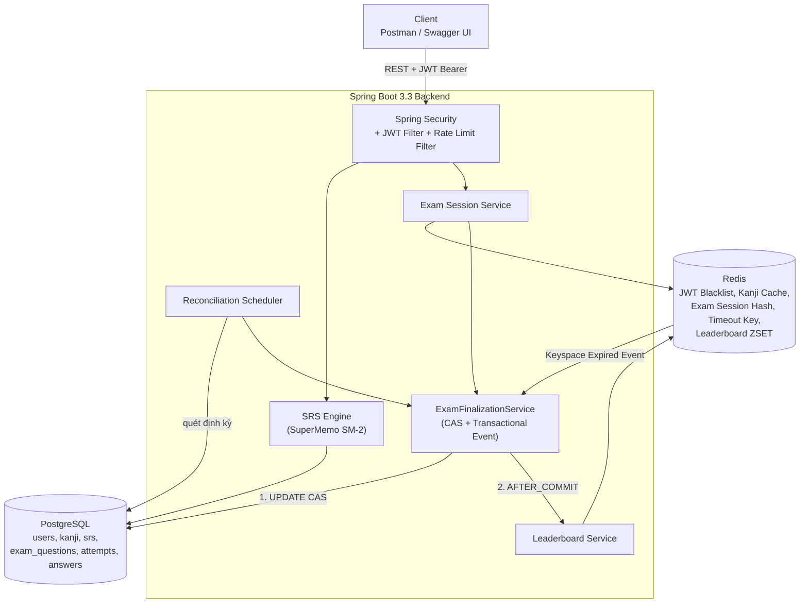

# Smart Kanji Mastery & JLPT Mock Exam Platform

Backend Spring Boot cho nền tảng học Kanji cá nhân hóa (thuật toán SuperMemo SM-2) và thi thử JLPT trực tuyến với thi thời gian thực, chấm điểm chống race condition, và bảng xếp hạng cập nhật tức thì. Kèm live-demo Frontend React + TypeScript.

> Dự án được xây dựng theo kế hoạch chi tiết tại [k_ho_ch_tri_n_khai_d_n_spring_boot.md](k_ho_ch_tri_n_khai_d_n_spring_boot.md) — tài liệu đó ghi lại toàn bộ quá trình thiết kế, các vấn đề kỹ thuật phát sinh (race condition, dual-write, N+1 query...) và giải pháp tương ứng.

## Mục lục

- [Điểm sáng kỹ thuật](#điểm-sáng-kỹ-thuật)
- [Kiến trúc hệ thống](#kiến-trúc-hệ-thống)
- [Thuật toán SuperMemo SM-2](#thuật-toán-supermemo-sm-2)
- [Chấm điểm bài thi: Race Condition & Transaction Boundary](#chấm-điểm-bài-thi-race-condition--transaction-boundary)
- [Tối ưu hiệu năng Database](#tối-ưu-hiệu-năng-database)
- [Database Schema](#database-schema)
- [API Endpoints](#api-endpoints)
- [Frontend Demo](#frontend-demo)
- [Chạy dự án bằng Docker (1 lệnh)](#chạy-dự-án-bằng-docker-1-lệnh)
- [Sao lưu & khôi phục dữ liệu](#sao-lưu--khôi-phục-dữ-liệu)
- [Giới hạn tần suất & hạn mức AI](#giới-hạn-tần-suất--hạn-mức-ai)
- [Chạy dự án để phát triển (dev mode)](#chạy-dự-án-để-phát-triển-dev-mode)
- [Testing](#testing)
- [Cấu trúc thư mục](#cấu-trúc-thư-mục)

---

## Điểm sáng kỹ thuật

1. **Thuật toán SRS (SuperMemo SM-2)** tự cài đặt từ công thức gốc, không dùng thư viện có sẵn.
2. **Composite Index PostgreSQL** cho bảng tiến độ học — đo thật trên 250,000 dòng dữ liệu: **0.47ms** (xem [benchmark-explain-analyze.md](backend/docs/benchmark-explain-analyze.md)).
3. **Session Management & Auto-Submit qua Redis**: Redis Hash lưu bài làm dở, Redis Keyspace Notification tự động thu bài khi hết giờ.
4. **Reconciliation Job** — lớp dự phòng bù cho giới hạn "best-effort" của Keyspace Notification, đảm bảo không bài thi nào bị "treo" vĩnh viễn.
5. **Race Condition & Idempotency**: compare-and-swap ở tầng SQL giải quyết tranh chấp giữa 3 luồng có thể cùng chốt điểm 1 bài thi.
6. **Transaction Boundary rõ ràng**: tách hẳn thao tác PostgreSQL khỏi Redis bằng `@TransactionalEventListener(AFTER_COMMIT)`, tránh dual-write.
7. **Real-time Leaderboard** bằng Redis Sorted Set, không query sắp xếp nặng vào PostgreSQL.
8. **Testcontainers**: integration test chạy trên Postgres + Redis thật trong container tạm, không phụ thuộc môi trường máy dev, chạy được trong CI.

---

## Kiến trúc hệ thống



**Luồng chốt điểm bài thi** (điểm kỹ thuật trọng tâm của dự án) có 3 nơi có thể kích hoạt gần như đồng thời — Submit thủ công, Redis Keyspace Expired Event, Reconciliation Job — nhưng đều đi qua **một điểm chốt duy nhất**: `ExamFinalizationService.finalize()`. Xem giải thích chi tiết ở [phần Race Condition](#chấm-điểm-bài-thi-race-condition--transaction-boundary).

---

## Thuật toán SuperMemo SM-2

Cài đặt tại [`SrsCalculatorService`](backend/src/main/java/com/kanjimastery/backend/service/SrsCalculatorService.java), theo đúng thuật toán gốc của Piotr Wozniak:

| Bước | Công thức / Quy tắc |
|---|---|
| Cập nhật độ dễ (EF) | $EF' = EF + (0.1 - (5-q) \times (0.08 + (5-q) \times 0.02))$ — áp dụng cho **mọi** giá trị $q \in [0,5]$ |
| Chặn dưới | $EF' = \max(EF', 1.3)$ |
| Interval lần 1 | $I_1 = 1$ ngày (nếu $q \ge 3$) |
| Interval lần 2 | $I_2 = 6$ ngày |
| Interval lần $n \ge 3$ | $I_n = \text{round}(I_{n-1} \times EF')$ — dùng EF **vừa cập nhật**, không phải EF cũ |
| Trả lời sai ($q < 3$) | Reset `repetition_count = 0`, `interval = 1 ngày` — **EF vẫn được cập nhật** theo công thức trên |

7 unit test tại [`SrsCalculatorServiceTest`](backend/src/test/java/com/kanjimastery/backend/service/SrsCalculatorServiceTest.java) phủ toàn bộ nhánh: $q=5$ liên tiếp, $q<3$ reset, chặn $EF \ge 1.3$, và validate input ngoài khoảng $[0,5]$.

---

## Chấm điểm bài thi: Race Condition & Transaction Boundary

### Vấn đề

Một bài thi có thể được chốt điểm bởi **3 luồng độc lập**, gần như đồng thời:

1. Thí sinh bấm **Submit** thủ công.
2. **Redis Keyspace Notification** bắn về khi key `exam:timeout:{attemptId}` hết hạn.
3. **Reconciliation Job** quét thấy attempt quá hạn chưa xử lý.

Nếu không kiểm soát, có thể bị tính điểm 2-3 lần, ghi trùng `user_exam_answers`, hoặc đẩy leaderboard nhiều lần.

### Giải pháp: CAS ở tầng SQL

Cả 3 luồng đều gọi vào **một điểm chốt duy nhất** — [`ExamFinalizationService.finalize()`](backend/src/main/java/com/kanjimastery/backend/service/ExamFinalizationService.java):

```sql
UPDATE user_exam_attempts
SET status = :status, total_score = :score, time_spent_seconds = :timeSpent, submitted_at = :submittedAt
WHERE id = :id AND status = 'IN_PROGRESS';
```

Chỉ luồng khiến **số dòng ảnh hưởng > 0** mới được ghi `user_exam_answers` và publish event chốt điểm — các luồng thua cuộc no-op ngay lập tức, không ghi trùng.

Đã kiểm chứng bằng **8 request submit đồng thời thật** (curl chạy song song) vào cùng 1 attempt: đúng 1 lần ghi DB, đúng số dòng answers dự kiến, leaderboard không bị cộng dồn — và bằng integration test [`ExamFinalizationConcurrencyIT`](backend/src/test/java/com/kanjimastery/backend/service/ExamFinalizationConcurrencyIT.java) dùng `ExecutorService`/`CountDownLatch` trên Postgres thật (Testcontainers).

### Transaction Boundary: tránh dual-write

`@Transactional` của Spring chỉ quản lý được PostgreSQL — **không** rollback được lệnh Redis đã gửi đi. Nếu đẩy điểm lên Redis ZSET ngay trong lúc transaction DB chưa chắc chắn commit, leaderboard có thể hiển thị điểm cho một attempt mà DB thực ra không lưu.

Giải pháp: tách phần ghi DB (trong `@Transactional`) khỏi phần ghi Redis, dùng `@TransactionalEventListener(phase = AFTER_COMMIT)` — Redis (leaderboard, dọn session) **chỉ được cập nhật sau khi DB commit thành công chắc chắn**. Xem [`ExamFinalizedEventListener`](backend/src/main/java/com/kanjimastery/backend/listener/ExamFinalizedEventListener.java).

Test [`finalize_whenAnswerInsertFails_shouldRollbackStatusBackToInProgress`](backend/src/test/java/com/kanjimastery/backend/service/ExamFinalizationConcurrencyIT.java) mô phỏng lỗi ghi answers và xác nhận status quay về `IN_PROGRESS` (không kẹt ở trạng thái lỡ dở) để Reconciliation Job xử lý lại.

### Redis Keyspace Notification chỉ là "best-effort"

Redis không đảm bảo delivery cho sự kiện key hết hạn (có thể mất khi server bận hoặc client mất kết nối tạm thời). Vì vậy hệ thống có **2 lớp bảo vệ độc lập**:

- **Lớp chính (realtime)**: [`ExamTimeoutListener`](backend/src/main/java/com/kanjimastery/backend/listener/ExamTimeoutListener.java) lắng nghe Keyspace Notification.
- **Lớp dự phòng**: [`ExamReconciliationJob`](backend/src/main/java/com/kanjimastery/backend/job/ExamReconciliationJob.java) (`@Scheduled`) quét các attempt quá hạn mỗi 90 giây.

Đã kiểm chứng thật: xóa thẳng key `exam:timeout:{id}` để mô phỏng Redis "bỏ lỡ" event — Reconciliation Job vẫn tự phát hiện và xử lý độc lập, hoàn toàn không cần Keyspace Notification.

### TTL: tách Hash dữ liệu khỏi marker hết giờ

Redis Hash `exam:session:{attemptId}` (chứa đáp án) có TTL **dôi ra** (`duration + 1800s buffer`), khác với key marker `exam:timeout:{attemptId}` (TTL đúng bằng thời gian thi). Nếu đặt trùng TTL, dữ liệu bài làm có thể bị xóa đúng lúc event đang được xử lý, khiến không còn gì để chấm điểm. Xem [`ExamSessionStoreIT`](backend/src/test/java/com/kanjimastery/backend/repository/ExamSessionStoreIT.java).

---

## Tối ưu hiệu năng Database

Composite index `idx_user_next_review (user_id, next_review_at)` phục vụ API `GET /api/v1/srs/daily-cards`. Đo thật trên **250,002 dòng** dữ liệu synthetic (script tại [`benchmark_seed.sql`](backend/scripts/benchmark_seed.sql)):

```
Limit  (actual time=0.025..0.028 rows=20 loops=1)
  ->  Index Scan using idx_user_next_review on user_kanji_srs
        Index Cond: ((user_id = $0) AND (next_review_at <= now()))
Execution Time: 0.470 ms
```

Chi tiết đầy đủ tại [benchmark-explain-analyze.md](backend/docs/benchmark-explain-analyze.md). Query planner dùng đúng Index Scan, không Seq Scan, dù bảng có 250K dòng — nhanh hơn mục tiêu $<30\text{ms}$ khoảng 60 lần.

Ngoài ra, mọi chỗ cần ghép N bản ghi (chấm điểm 20-50 câu hỏi, build leaderboard) đều dùng `findAllById()` batch-fetch **1 query duy nhất** thay vì vòng lặp gọi `findById()` — tránh N+1 Query.

---

## Database Schema

6 bảng chính (PostgreSQL, quản lý bằng Flyway — xem [`db/migration`](backend/src/main/resources/db/migration)):

| Bảng | Vai trò |
|---|---|
| `users` | Tài khoản, mật khẩu hash (BCrypt), role |
| `kanji` | Từ điển Hán tự (character, Hán-Việt, on/kun-yomi, số nét, JLPT level) |
| `user_kanji_srs` | Tiến độ SRS mỗi user-kanji (composite index `user_id, next_review_at`) |
| `exam_questions` | Ngân hàng câu hỏi trắc nghiệm JLPT |
| `user_exam_attempts` | Mỗi lượt thi (status: `IN_PROGRESS` / `COMPLETED` / `TIMEOUT`) |
| `user_exam_answers` | Chi tiết từng câu trả lời — phục vụ tính năng xem lại bài làm |

---

## API Endpoints

Tài liệu API đầy đủ, tương tác được (có nút **Authorize** để dán JWT) tại `/swagger-ui.html` khi chạy app. Tóm tắt:

| Nhóm | Endpoint | Mô tả |
|---|---|---|
| Auth | `POST /api/v1/auth/register` `/login` `/refresh-token` `/logout` `/change-password` | Đăng ký/đăng nhập, Refresh Token Rotation, JWT Blacklist khi logout |
| Kanji | `GET /api/v1/kanji` `/{id}` | Tra cứu từ điển (có phân trang, cache Redis) |
| SRS | `GET /api/v1/srs/daily-cards` `POST /review` `GET /stats` | Ôn tập theo SM-2 |
| Exam | `POST /api/v1/exams/start` `PUT .../answers` `GET .../session` `POST .../submit` `GET .../review` | Thi thử, auto-save, resume, nộp bài, xem lại |
| Leaderboard | `GET /api/v1/exams/leaderboard` `/my-rank` | Bảng xếp hạng real-time (Redis ZSET) |

---

## Frontend Demo

React 18 + Vite + TypeScript, Tailwind CSS, TanStack Query, Axios, React Router, Zustand — mã nguồn tại [`frontend/`](frontend/).

3 màn hình chính:

1. **Ôn tập (Flashcard SRS)** — [`FlashcardPage`](frontend/src/pages/FlashcardPage.tsx): thẻ lật 3D (CSS `transform-style: preserve-3d`), phím tắt Space để lật / 0-5 để chấm quality, gọi `POST /srs/review` và chuyển thẻ tiếp theo bằng **Optimistic Update** của TanStack Query (`onMutate` xoá thẻ khỏi cache ngay, rollback nếu lỗi) để tránh giật/nhấp nháy khi chờ round-trip mạng.
2. **Thi thử (Exam Workspace)** — [`ExamWorkspacePage`](frontend/src/pages/ExamWorkspacePage.tsx): Question Palette theo trạng thái đã làm/chưa làm, đếm ngược dựa hoàn toàn vào `remainingSeconds` Backend trả về (không so sánh `new Date()` để tránh clock drift), auto-save debounce 300ms mỗi lần chọn đáp án, tự động nộp bài khi hết giờ, khôi phục đáp án đã tick khi F5 qua `GET .../session`.
3. **Kết quả & Xem lại** — [`ExamResultPage`](frontend/src/pages/ExamResultPage.tsx): điểm số, tỉ lệ đúng, thời gian làm bài; danh sách so sánh đáp án đã chọn vs đáp án đúng kèm giải thích; tab Bảng xếp hạng (Redis ZSET) highlight hàng của user hiện tại.

Điểm kỹ thuật đáng chú ý — [`api/client.ts`](frontend/src/api/client.ts): **Axios Interceptor tự động refresh JWT có mutex**. Backend làm Refresh Token Rotation (token cũ bị revoke ngay khi dùng), nên nhiều request `401` xảy ra gần như đồng thời chỉ được phép gọi `/auth/refresh-token` **đúng một lần** — dùng chung một Promise cấp-module, các request khác xếp hàng chờ rồi tự retry với token mới, tránh trường hợp request refresh chạy song song khiến người dùng bị văng logout oan.

> Giới hạn đã biết: `GET /exams/attempts/{id}/session` chỉ trả lại đáp án đã tick, không trả lại nội dung câu hỏi (Backend không thiết kế endpoint lộ câu hỏi ngoài luồng bắt đầu thi). Frontend tự cache nội dung câu hỏi vào `sessionStorage` lúc `/exams/start` để phục vụ khôi phục khi F5 cùng tab/trình duyệt — xem [`lib/examCache.ts`](frontend/src/lib/examCache.ts).

---

## Chạy dự án bằng Docker (1 lệnh)

Yêu cầu: Docker + Docker Compose.

```bash
cp .env.example .env
# Sửa JWT_SECRET trong .env thành chuỗi ngẫu nhiên (>= 32 ký tự) trước khi chạy thật

docker-compose up -d
```

Sau khi cả 5 container (`postgres`, `redis`, `backend`, `frontend`, `db-backup`) khởi động xong (~1-2 phút cho lần đầu vì phải build image):

- Web app: `http://localhost:3000`. Điện thoại cùng mạng Wi-Fi mở bằng `http://<IP của máy>:3000`.
- API: `http://localhost:8080`
- Swagger UI: `http://localhost:8080/swagger-ui.html`

API (8080), PostgreSQL (5433) và Redis (6379) chỉ mở cho chính máy chạy Docker (`127.0.0.1`). Chỉ cổng 3000 của web app mở cho mạng LAN, và mọi request API từ máy khác đều phải đi qua nginx.

Dừng các container (dữ liệu vẫn được giữ lại trong Docker volume):

```bash
docker compose down
```

> ⚠️ Không chạy `docker compose down -v` trừ khi thật sự muốn xoá sạch dữ liệu: cờ `-v` xoá luôn volume chứa database (toàn bộ từ vựng, câu ví dụ, tiến độ ôn tập). Lỡ tay thì khôi phục từ bản backup theo mục bên dưới.

---

## Sao lưu & khôi phục dữ liệu

Container `db-backup` tự sao lưu database mỗi 24 giờ ra thư mục `backups/` trên máy thật (file `kanji_YYYYMMDD_HHMMSS.dump`) và giữ 14 bản gần nhất. Máy tắt nhiều ngày thì lần bật lại đầu tiên sẽ backup bù ngay. Thư mục, chu kỳ và số bản giữ lại chỉnh bằng `BACKUP_DIR`, `BACKUP_INTERVAL_HOURS`, `BACKUP_KEEP` trong `.env`. Nên trỏ `BACKUP_DIR` tới một thư mục OneDrive/Google Drive để vẫn còn bản sao khi hỏng máy. Thư mục `backups/` không được commit vì chứa cả tài khoản người dùng.

Backup ngay (có nhãn thì bản đó không bao giờ bị xoá tự động):

```bash
docker exec kanji_db_backup backup truoc-khi-nang-cap
```

Khôi phục: lệnh `restore` tự backup dữ liệu hiện tại trước (nhãn `truoc-khi-restore`) và chạy trong một transaction, lỗi giữa chừng thì database giữ nguyên.

```bash
docker exec kanji_db_backup restore        # xem danh sách các bản backup
docker compose stop backend
docker exec kanji_db_backup restore kanji_20260930_142909.dump
docker exec kanji_redis sh -c "redis-cli --scan --pattern 'kanji::*' | xargs -r redis-cli del"
docker compose start backend
```

Lệnh thứ 4 xoá cache từ vựng cũ trong Redis. Chuyển sang máy mới: chép file `.dump` vào thư mục `backups/`, chạy `docker compose up -d`, rồi làm các bước khôi phục ở trên.

---

## Giới hạn tần suất & hạn mức AI

| Giới hạn | Mặc định | Cấu hình |
|---|---|---|
| Đăng nhập, theo IP | 5 lần/phút | `app.rate-limit.login` |
| Đăng ký, theo IP | 3 lần/phút | `app.rate-limit.register` |
| Sai mật khẩu, theo tài khoản | 10 lần trong 15 phút thì khoá tài khoản 15 phút | `app.rate-limit.login-lock` |
| Tạo trắc nghiệm, theo tài khoản | 30 lần/phút | `app.rate-limit.quiz` |
| Request Gemini, cả hệ thống | 100 request/ngày (UTC) | `GEMINI_DAILY_LIMIT` trong `.env` |
| Từ sinh câu ví dụ thất bại | Thất bại 2 lần thì bỏ qua từ đó 24 giờ | `QuizService` |

- **IP người dùng do nginx xác định.** nginx ghi đè header `X-Forwarded-For`, Spring (`server.forward-headers-strategy: native`) chỉ tin header này khi request đến từ mạng nội bộ, và backend chỉ mở cổng trên `127.0.0.1`. Vì vậy client không thể tự đặt IP giả để vượt giới hạn đăng nhập.
- **Câu ví dụ được lưu lại.** Mỗi lần tạo trắc nghiệm, bộ câu hỏi luôn mới, nhưng câu ví dụ đã lưu trong database thì được dùng lại. Gemini chỉ được gọi cho từ chưa có câu.
- **Khi đưa app lên mạng:** đặt `REGISTRATION_ENABLED=false` trong `.env` để người lạ không tự tạo tài khoản được.

---

## Chạy dự án để phát triển (dev mode)

Chỉ chạy Postgres + Redis bằng Docker, chạy backend trực tiếp bằng Maven/IDE (hot reload nhanh hơn):

```bash
docker-compose up -d postgres redis
cd backend
./mvnw spring-boot:run
```

> Lưu ý: `docker-compose.yml` map PostgreSQL ra cổng **5433** (không phải 5432 mặc định) để tránh xung đột nếu máy dev đã có sẵn PostgreSQL native.

Chạy Frontend riêng (hot reload, Vite dev server proxy `/api` sang `localhost:8080`):

```bash
cd frontend
npm install
npm run dev
```

Mở `http://localhost:5173`.

---

## Testing

```bash
cd backend
./mvnw test
```

- **Unit test** (không cần Docker): `SrsCalculatorServiceTest`, `JwtServiceTest`, `UserServiceTest`.
- **Integration test** (Testcontainers - tự khởi chạy Postgres + Redis trong container tạm, không phụ thuộc môi trường local): `ExamFinalizationConcurrencyIT` (race condition + rollback), `ExamSessionStoreIT` (TTL buffer), `KanjiMasteryApplicationTests` (context loads).

CI ([`.github/workflows/ci.yml`](.github/workflows/ci.yml)) chạy toàn bộ test suite tự động trên mỗi push/PR vào `main`.

---

## Cấu trúc thư mục

Backend tổ chức theo **package-by-layer** (tầng Controller/Service/Repository/Model kinh điển):

```
Kanji_App/
├── docker-compose.yml          # Postgres + Redis + Backend + Frontend + DB backup
├── .env.example
├── .github/workflows/ci.yml
├── k_ho_ch_tri_n_khai_d_n_spring_boot.md   # Kế hoạch & nhật ký thiết kế chi tiết
├── db-backup/                  # Container sao lưu định kỳ: backup.sh, restore.sh, backup-loop.sh
├── backups/                    # Nơi lưu file .dump (không commit)
├── backend/
│   ├── Dockerfile               # Multi-stage: Maven build -> JRE Alpine runtime
│   ├── scripts/benchmark_seed.sql
│   ├── docs/benchmark-explain-analyze.md
│   └── src/main/java/com/kanjimastery/backend/
│       ├── controller/  # REST endpoint - Auth, Kanji, Srs, Exam, Leaderboard
│       ├── service/     # Business logic (SM-2, finalize CAS, JWT, refresh rotation...)
│       ├── repository/  # Spring Data JPA + ExamSessionStore (Redis)
│       ├── model/       # Entity JPA: User, Kanji, UserKanjiSrs, ExamQuestion...
│       ├── dto/         # Request/Response DTO
│       ├── config/      # SecurityConfig, CacheConfig, *Properties
│       ├── security/    # JwtAuthenticationFilter, RateLimitFilter
│       ├── event/       # ExamFinalizedEvent
│       ├── listener/    # ExamFinalizedEventListener, ExamTimeoutListener
│       ├── job/         # ExamReconciliationJob (@Scheduled)
│       └── exception/   # GlobalExceptionHandler dùng chung
└── frontend/
    ├── Dockerfile               # Multi-stage: Vite build -> Nginx Alpine runtime
    ├── nginx.conf                # SPA fallback + proxy /api/ -> backend:8080
    └── src/
        ├── api/         # Axios client (interceptor mutex refresh) + types + endpoints
        ├── store/       # Zustand: authStore (access/refresh token, username)
        ├── routes/      # ProtectedRoute
        ├── pages/       # Login, Register, Flashcard, ExamSetup/Workspace/Result
        └── components/  # FlipCard, QuestionPalette, Countdown, Leaderboard, ui/
```
